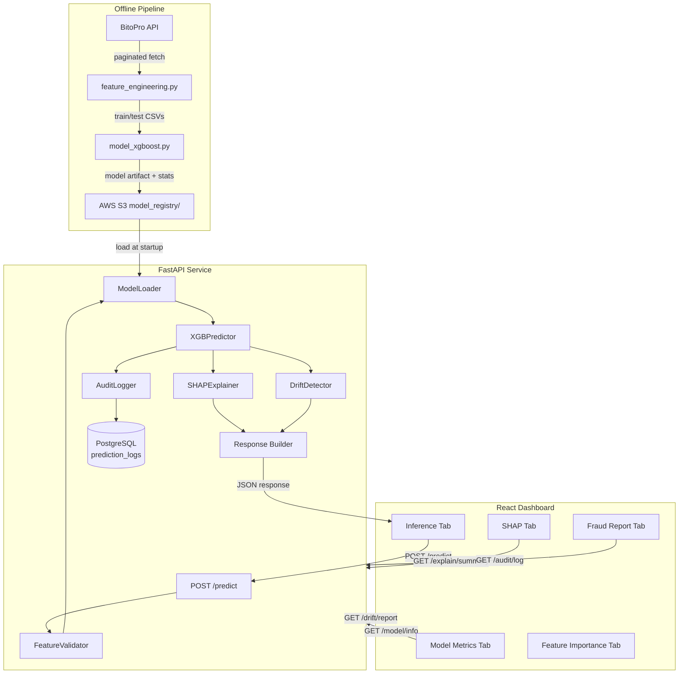

# AML Fraud Detection System — Design

## Overview

This document describes the technical design for the production-grade AML fraud detection system for BitoPro exchange. The system extends the existing two-script pipeline (`feature_engineering.py` → `model_xgboost.py`) with a model serving API, explainability layer, drift detection, compliance dashboard, and audit trail.

### Design Goals

- Serve real-time batch predictions with sub-2s p95 latency for up to 1,000 users
- Provide SHAP-based explainability for every prediction, suitable for regulatory review
- Detect data drift using PSI on top-20 SHAP features before model performance silently degrades
- Maintain a tamper-evident audit log in PostgreSQL for 90-day regulatory retention
- Expose a React compliance dashboard that requires zero code execution from compliance officers

### Key Technical Decisions

| Decision | Choice | Rationale |
|---|---|---|
| Model artifact storage | AWS S3 with `model_registry/` prefix | Versioning without extra infrastructure; rollback via prefix |
| Drift detection method | Population Stability Index (PSI) | Industry standard for AML/credit scoring; interpretable thresholds |
| Audit log storage | PostgreSQL `prediction_logs` table | ACID guarantees; SQL filtering for audit queries; existing infra |
| API framework | FastAPI | Async support; automatic OpenAPI docs; Pydantic validation |
| SHAP computation | `shap.TreeExplainer` (same as training) | Exact values for tree models; consistent with existing SHAP plots |
| Training distribution stats | Saved as JSON alongside model artifact in S3 | Co-located with model; loaded once at startup |

---

## Architecture



### Data Flow — Inference Request

```
Client → POST /predict
  → FeatureValidator (Pydantic schema check)
  → ModelLoader (cached in memory, loaded from S3 at startup)
  → XGBPredictor (batch predict_proba)
  → SHAPExplainer (optional, per-user top-N features)
  → DriftDetector (PSI vs training distribution)
  → AuditLogger (async write to PostgreSQL)
  → Response (user_id, risk_score, predicted_label, threshold_used, shap_values?)
```

---

## Components and Interfaces

### 1. ModelLoader

Responsible for loading the XGBoost model artifact and training distribution statistics from S3 at startup. Caches in memory; supports hot-reload via a `/model/reload` admin endpoint.

```python
class ModelLoader:
    def load_from_s3(self, s3_uri: str) -> None: ...
    def get_model(self) -> xgb.XGBClassifier: ...
    def get_metadata(self) -> ModelMetadata: ...
    def get_training_stats(self) -> dict[str, FeatureStats]: ...
```

S3 artifact layout under `model_registry/{version}/`:
- `model.ubj` — XGBoost binary model
- `metadata.json` — version, mode, training date, feature list, threshold
- `training_stats.json` — per-feature mean, std, percentiles (p5/p25/p50/p75/p95)
- `feature_importance.csv` — top-20 SHAP features (used by drift detector)

### 2. XGBPredictor

Wraps the loaded model. Handles feature alignment (same column ordering as training), inf→nan→0 fill, and threshold application.

```python
class XGBPredictor:
    def predict_batch(self, features: pd.DataFrame) -> list[PredictionResult]: ...
    def predict_single(self, user_id: str, features: dict) -> PredictionResult: ...
```

### 3. SHAPExplainer

Computes per-user SHAP values using `shap.TreeExplainer`. Initialized once at startup with the loaded model. Falls back gracefully (HTTP 501) if `shap` is not installed.

```python
class SHAPExplainer:
    def explain_user(self, user_id: str, features: pd.Series, top_n: int = 10) -> list[SHAPContribution]: ...
    def get_global_summary_png(self, sample_df: pd.DataFrame) -> bytes: ...
```

### 4. DriftDetector

Computes PSI for each of the top-20 SHAP features by comparing the current inference batch distribution against the saved training distribution statistics.

```python
class DriftDetector:
    def compute_psi(self, feature: str, current_values: np.ndarray) -> float: ...
    def compute_batch_drift(self, batch_df: pd.DataFrame) -> DriftReport: ...
```

PSI thresholds (industry standard):
- `PSI < 0.1` → `ok` (no significant drift)
- `0.1 ≤ PSI < 0.2` → `warning` (moderate drift, monitor)
- `PSI ≥ 0.2` → `critical` (significant drift, consider retraining)

Overall status = worst status across all monitored features.

### 5. AuditLogger

Writes prediction records to PostgreSQL asynchronously (non-blocking). Uses `asyncpg` for async writes. Implements 90-day retention via a scheduled cleanup job.

```python
class AuditLogger:
    async def log_prediction(self, record: PredictionLogRecord) -> None: ...
    async def query_logs(self, filters: AuditQueryFilters) -> list[PredictionLogRecord]: ...
    async def export_csv(self, filters: AuditQueryFilters) -> bytes: ...
```

### 6. FastAPI Application

Thin routing layer. All business logic lives in the components above.

```
app/
├── main.py              # FastAPI app, lifespan startup/shutdown
├── routers/
│   ├── predict.py       # POST /predict
│   ├── explain.py       # GET /explain/{user_id}, GET /explain/summary
│   ├── drift.py         # GET /drift/report
│   ├── audit.py         # GET /audit/log
│   └── model.py         # GET /health, GET /model/info
├── services/
│   ├── model_loader.py
│   ├── predictor.py
│   ├── shap_explainer.py
│   ├── drift_detector.py
│   └── audit_logger.py
├── models/              # Pydantic schemas
│   ├── prediction.py
│   ├── explain.py
│   ├── drift.py
│   └── audit.py
└── config.py            # env var loading (MODEL_S3_URI, DATABASE_URL, etc.)
```

### 7. React Dashboard

Multi-tab SPA. All API calls go through a central `apiClient` with mock fallback when the backend is unavailable.

Tabs and their primary API calls:
- **Model Metrics** → `GET /model/info`
- **Feature Importance** → `GET /model/info` (feature_importance embedded)
- **SHAP** → `GET /explain/summary` (global PNG), `GET /explain/{user_id}` (per-user)
- **Inference** → `POST /predict` (CSV upload)
- **Fraud Report** → `GET /audit/log` + CSV export

---

## Data Models

### PostgreSQL: `prediction_logs` Table

```sql
CREATE TABLE prediction_logs (
    id                  BIGSERIAL PRIMARY KEY,
    prediction_id       UUID NOT NULL DEFAULT gen_random_uuid(),
    created_at          TIMESTAMPTZ NOT NULL DEFAULT NOW(),
    model_version       VARCHAR(64) NOT NULL,
    mode                VARCHAR(16) NOT NULL CHECK (mode IN ('full', 'no_leak', 'safe')),
    input_hash          VARCHAR(64) NOT NULL,        -- SHA-256 of input feature JSON
    user_id             VARCHAR(64) NOT NULL,
    risk_score          DOUBLE PRECISION NOT NULL,
    predicted_label     SMALLINT NOT NULL CHECK (predicted_label IN (0, 1)),
    threshold_used      DOUBLE PRECISION NOT NULL,
    drift_status        VARCHAR(16),                 -- 'ok' | 'warning' | 'critical' | NULL
    batch_id            UUID,                        -- groups rows from the same /predict call
    retained_until      TIMESTAMPTZ NOT NULL         -- created_at + 90 days
);

CREATE INDEX idx_prediction_logs_user_id    ON prediction_logs (user_id);
CREATE INDEX idx_prediction_logs_created_at ON prediction_logs (created_at DESC);
CREATE INDEX idx_prediction_logs_batch_id   ON prediction_logs (batch_id);
```

Retention: a nightly job deletes rows where `retained_until < NOW()`.

### S3 Artifact Structure

```
s3://{bucket}/model_registry/
├── latest -> v20240115_safe/          # symlink-style pointer (a small JSON redirect file)
├── v20240115_safe/
│   ├── model.ubj                      # XGBoost binary (ubj = universal binary JSON, smaller than pkl)
│   ├── metadata.json
│   ├── training_stats.json
│   └── feature_importance.csv
└── v20240108_safe/
    └── ...
```

`metadata.json` schema:
```json
{
  "version": "v20240115_safe",
  "mode": "safe",
  "training_date": "2024-01-15T08:30:00Z",
  "feature_count": 142,
  "feature_names": ["twd_txn_count", "..."],
  "threshold": 0.42,
  "f1": 0.871,
  "auc": 0.953,
  "pr_auc": 0.812
}
```

`training_stats.json` schema (one entry per monitored feature):
```json
{
  "twd_txn_count": {
    "mean": 12.4,
    "std": 8.1,
    "p5": 1.0,
    "p25": 5.0,
    "p50": 10.0,
    "p75": 18.0,
    "p95": 32.0,
    "bins": [0, 5, 10, 20, 50, 100, 999999]
  }
}
```

### Pydantic Schemas (API)

```python
# Request
class PredictRequest(BaseModel):
    mode: Literal["full", "no_leak", "safe"] = "safe"
    include_shap: bool = False
    users: list[dict[str, Any]]   # list of feature dicts keyed by feature name

# Per-user prediction result
class PredictionResult(BaseModel):
    user_id: str
    risk_score: float              # raw predict_proba output [0, 1]
    predicted_label: int           # 0 or 1
    threshold_used: float
    shap_values: list[SHAPContribution] | None = None

# SHAP contribution
class SHAPContribution(BaseModel):
    feature_name: str
    feature_value: float
    shap_value: float              # positive = increases fraud risk
    direction: Literal["increases_risk", "decreases_risk"]

# Drift report
class DriftReport(BaseModel):
    overall_status: Literal["ok", "warning", "critical"]
    computed_at: datetime
    features: list[FeatureDriftResult]

class FeatureDriftResult(BaseModel):
    feature_name: str
    psi: float
    status: Literal["ok", "warning", "critical"]

# Audit query filters
class AuditQueryFilters(BaseModel):
    user_id: str | None = None
    date_from: datetime | None = None
    date_to: datetime | None = None
    page: int = 1
    page_size: int = 100
```

---

## API Design

### `POST /predict`

Accepts a JSON payload with a list of user feature dicts. Returns predictions for all users.

**Request:**
```json
{
  "mode": "safe",
  "include_shap": false,
  "users": [
    { "user_id": "u001", "twd_txn_count": 5, "twd_night_ratio": 0.8, "..." : "..." }
  ]
}
```

**Response 200:**
```json
{
  "batch_id": "550e8400-e29b-41d4-a716-446655440000",
  "model_version": "v20240115_safe",
  "drift_status": "ok",
  "predictions": [
    {
      "user_id": "u001",
      "risk_score": 0.87,
      "predicted_label": 1,
      "threshold_used": 0.42,
      "shap_values": null
    }
  ]
}
```

**Response 422:** Input schema validation failure with field-level error details.

---

### `GET /health`

```json
{ "status": "ok", "model_loaded": true, "db_connected": true }
```

---

### `GET /model/info`

```json
{
  "version": "v20240115_safe",
  "mode": "safe",
  "training_date": "2024-01-15T08:30:00Z",
  "feature_count": 142,
  "threshold": 0.42,
  "metrics": { "f1": 0.871, "auc": 0.953, "pr_auc": 0.812 },
  "top_features": [
    { "rank": 1, "feature": "twd_night_ratio", "importance": 0.142 }
  ]
}
```

---

### `GET /explain/{user_id}`

Returns the most recent prediction's SHAP breakdown for a given user.

**Response 200:**
```json
{
  "user_id": "u001",
  "risk_score": 0.87,
  "top_features": [
    { "feature_name": "twd_night_ratio", "feature_value": 0.8, "shap_value": 0.31, "direction": "increases_risk" }
  ]
}
```

**Response 404:** User not found in recent prediction logs.
**Response 501:** SHAP library not installed.

---

### `GET /explain/summary`

Returns the global SHAP summary plot as a PNG image (`Content-Type: image/png`).

---

### `GET /drift/report`

```json
{
  "overall_status": "warning",
  "computed_at": "2024-01-20T14:00:00Z",
  "features": [
    { "feature_name": "twd_night_ratio", "psi": 0.13, "status": "warning" },
    { "feature_name": "crypto_txn_count", "psi": 0.04, "status": "ok" }
  ]
}
```

---

### `GET /audit/log`

Query params: `user_id`, `date_from`, `date_to`, `page`, `page_size`.

**Response 200:**
```json
{
  "total": 1523,
  "page": 1,
  "page_size": 100,
  "records": [
    {
      "prediction_id": "...",
      "created_at": "2024-01-20T14:00:00Z",
      "user_id": "u001",
      "risk_score": 0.87,
      "predicted_label": 1,
      "threshold_used": 0.42,
      "model_version": "v20240115_safe",
      "mode": "safe",
      "drift_status": "ok"
    }
  ]
}
```

`GET /audit/log?export=csv` returns a CSV file download.

---

## Error Handling

| Scenario | HTTP Status | Behavior |
|---|---|---|
| Invalid input schema | 422 | Pydantic validation error with field details |
| Model not loaded (S3 unavailable at startup) | 503 | `/health` returns `model_loaded: false`; `/predict` returns 503 with message |
| SHAP library not installed | 501 | `/explain/*` returns 501 with install instructions |
| User not in prediction logs | 404 | `/explain/{user_id}` returns 404 |
| Database unavailable | 503 | Predictions still served; audit logging queued in memory (best-effort) |
| Drift status `critical` | 200 + warning field | Prediction response includes `"drift_warning": "Critical drift detected on features: [...]"` |
| Batch > 1,000 users | 400 | Returns 400 with message "Batch size exceeds limit of 1000" |

---

## Correctness Properties

*A property is a characteristic or behavior that should hold true across all valid executions of a system — essentially, a formal statement about what the system should do. Properties serve as the bridge between human-readable specifications and machine-verifiable correctness guarantees.*

### Property 1: Pagination completeness

*For any* mock API that returns data across N pages of batch_size rows each, `fetch_table_paginated` must return a DataFrame with exactly N × batch_size rows — no rows dropped, no rows duplicated.

**Validates: Requirements 1.1**

---

### Property 2: Feature set coverage

*For any* valid input dataset (user_info, twd_transfer, crypto_transfer, usdt_twd_trading, usdt_swap), the output feature DataFrame must contain at least one column from each of the following categories: KYC time deltas, behavioral aggregates (twd/crypto/trade/swap), chain-level risk (trc20/bsc), network features, IP features, fast-in-fast-out flags, and IsolationForest anomaly score.

**Validates: Requirements 1.3**

---

### Property 3: Pipeline idempotence

*For any* fixed input dataset, running the full feature engineering pipeline twice must produce DataFrames with identical column sets, identical row counts, and identical numeric values (within floating-point tolerance).

**Validates: Requirements 1.4**

---

### Property 4: Leakage column exclusion

*For any* input DataFrame, `prepare_xy` with `mode='no_leak'` must return a feature matrix that contains no column whose name includes any keyword from `HIGH_LEAKAGE_RISK_KEYWORDS`. With `mode='safe'`, the result must additionally exclude all demographic columns. With `mode='full'`, neither exclusion applies.

**Validates: Requirements 2.1**

---

### Property 5: Time-based split temporal ordering

*For any* DataFrame with a valid time column where at least 100 rows have non-null timestamps, `split_data` must produce a split where every timestamp in the validation set is greater than or equal to every timestamp in the training set.

**Validates: Requirements 2.2**

---

### Property 6: Leakage recommendation threshold

*For any* pair of F1 scores where `full_f1 - safe_f1 > 0.05`, the system must recommend submitting the `safe` version. For any pair where the gap is ≤ 0.05, no such recommendation is required.

**Validates: Requirements 2.6**

---

### Property 7: Default mode is safe

*For any* valid prediction request that omits the `mode` parameter, the API must process the request using `mode='safe'` and the response must reflect this mode. For any request with an explicit `mode` value in `{'full', 'no_leak', 'safe'}`, that mode must be used.

**Validates: Requirements 3.2**

---

### Property 8: Invalid input returns 422

*For any* request to `POST /predict` with a missing required field, a field of the wrong type, or a batch size exceeding 1,000, the API must return HTTP 422 with a response body that identifies the offending field(s).

**Validates: Requirements 3.6**

---

### Property 9: SHAP explanation completeness

*For any* user_id that has at least one record in `prediction_logs`, `GET /explain/{user_id}` must return a list of top-N feature contributions where each entry contains `feature_name`, `feature_value`, `shap_value`, and `direction` (one of `increases_risk` or `decreases_risk`). The list length must equal the requested `top_n` parameter (or the total number of features if fewer than `top_n` exist).

**Validates: Requirements 4.1, 4.2**

---

### Property 10: PSI self-similarity is zero

*For any* feature and any distribution, `compute_psi(feature, values_from_same_distribution)` must return a value less than 0.05. For any feature where the inference distribution is significantly shifted (mean shifted by more than 3 standard deviations), `compute_psi` must return a value ≥ 0.2 (critical threshold).

**Validates: Requirements 5.3**

---

### Property 11: Drift status reflects worst feature

*For any* drift report, the `overall_status` must equal the most severe status among all `features[*].status` entries, where `critical > warning > ok`. If any feature has `status='critical'`, the prediction response must include a non-null `drift_warning` field listing the critical features.

**Validates: Requirements 5.4, 5.5**

---

### Property 12: Audit log round-trip and append-only invariant

*For any* call to `POST /predict` with a batch of users, querying `GET /audit/log` after the call must return records matching every `user_id` in the batch with the correct `risk_score`, `predicted_label`, `model_version`, and `mode`. Furthermore, for any sequence of prediction calls, the total count of records in `prediction_logs` must be non-decreasing — records are never deleted during normal operation.

**Validates: Requirements 7.1, 7.2**

---

### Property 13: Audit log filter correctness

*For any* combination of filter parameters (`user_id`, `date_from`, `date_to`), every record returned by `GET /audit/log` must satisfy all supplied filter conditions: `record.user_id == user_id` (if provided), `record.created_at >= date_from` (if provided), and `record.created_at <= date_to` (if provided). No record that fails any filter condition may appear in the results.

**Validates: Requirements 7.3**

---

### Property 14: Audit CSV export column completeness

*For any* CSV exported via `GET /audit/log?export=csv`, every row must contain all six required columns: `user_id`, `risk_score`, `predicted_label`, `threshold_used`, `model_version`, `prediction_timestamp`. No required column may be absent or null.

**Validates: Requirements 7.4**

---

### Property 15: 90-day retention invariant

*For any* record inserted into `prediction_logs`, the `retained_until` field must be set to `created_at + 90 days`. No record with `retained_until >= NOW()` may be deleted by the retention cleanup job.

**Validates: Requirements 7.5**

---

### Property 16: Fraud report ranking and filtering

*For any* list of prediction results, the fraud report rendered by the React dashboard must contain only users with `predicted_label = 1`, and those users must be ordered by `risk_score` in descending order.

**Validates: Requirements 6.6**

---

### Property 17: Dashboard mock fallback

*For any* API call that results in a network error or non-2xx response, the corresponding React component must render successfully using mock data rather than throwing an unhandled error or displaying a blank state.

**Validates: Requirements 6.7**

---

## Testing Strategy

### Dual Testing Approach

Both unit tests and property-based tests are required. They are complementary:
- Unit tests catch concrete bugs at specific inputs and verify integration points
- Property tests verify universal correctness across the full input space

### Unit Tests

Focus on:
- Specific examples: `prepare_xy(mode='safe')` on a known DataFrame produces the exact expected column set
- Integration points: FastAPI test client verifying all endpoint routes return correct status codes
- Edge cases: empty API response returns empty DataFrame; SHAP 501 when library absent; batch > 1000 returns 400
- Database: `AuditLogger.log_prediction` writes a record retrievable by `query_logs`

### Property-Based Tests

Use **Hypothesis** (Python) for all property tests. Each test runs a minimum of **100 iterations**.

Each test must be tagged with a comment in the format:
`# Feature: aml-fraud-detection, Property {N}: {property_text}`

Property test mapping:

| Property | Test Description | Hypothesis Strategy |
|---|---|---|
| P1: Pagination completeness | Generate random N pages × batch_size, mock API, assert total rows | `st.integers(1, 20)`, `st.integers(100, 1000)` |
| P2: Feature set coverage | Generate random transaction DataFrames, run pipeline, assert column categories present | `st.from_regex` for user_ids, `st.floats` for amounts |
| P3: Pipeline idempotence | Generate random input, run pipeline twice, assert outputs equal | Same strategy as P2 |
| P4: Leakage column exclusion | Generate random DataFrames with leakage-keyword columns, assert exclusion per mode | `st.sampled_from(['full','no_leak','safe'])` |
| P5: Time-based split ordering | Generate DataFrames with random timestamps, assert train max ≤ valid min | `st.datetimes()` |
| P6: Leakage recommendation | Generate random (full_f1, safe_f1) pairs, assert recommendation logic | `st.floats(0, 1)` |
| P7: Default mode is safe | Generate valid predict requests without mode field, assert response mode='safe' | `st.fixed_dictionaries` |
| P8: Invalid input returns 422 | Generate malformed request bodies, assert 422 | `st.one_of` with missing/wrong-type fields |
| P9: SHAP explanation completeness | Generate random predictions, call explain, assert all fields present | `st.text()` for user_ids |
| P10: PSI self-similarity | Generate random distributions, compute PSI against self, assert < 0.05 | `st.lists(st.floats(0, 1000))` |
| P11: Drift status worst-feature | Generate random per-feature PSI values, assert overall = max severity | `st.lists(st.floats(0, 0.5))` |
| P12: Audit round-trip + append-only | Generate random batches, predict, query, assert records present and count non-decreasing | `st.lists(st.fixed_dictionaries(...))` |
| P13: Audit filter correctness | Generate random filter params, assert all returned records satisfy filters | `st.datetimes()`, `st.text()` |
| P14: CSV column completeness | Generate random audit records, export CSV, assert all 6 columns present | `st.builds(PredictionLogRecord)` |
| P15: 90-day retention invariant | Generate random `created_at` values, assert `retained_until = created_at + 90d` | `st.datetimes()` |
| P16: Fraud report ranking | Generate random prediction lists, render fraud report, assert label=1 only and sorted desc | `st.lists(st.builds(PredictionResult))` |
| P17: Dashboard mock fallback | Simulate network errors, assert component renders with mock data | `st.just(NetworkError())` |

### Property Test Configuration

```python
from hypothesis import given, settings, HealthCheck
import hypothesis.strategies as st

@settings(max_examples=100, suppress_health_check=[HealthCheck.too_slow])
@given(...)
def test_property_N_description(...)
    # Feature: aml-fraud-detection, Property N: <property text>
    ...
```

### Test File Layout

```
tests/
├── unit/
│   ├── test_feature_engineering.py   # REQ-1 examples and edge cases
│   ├── test_model_training.py        # REQ-2 examples
│   ├── test_api_endpoints.py         # REQ-3, REQ-4, REQ-5, REQ-7 endpoint tests
│   └── test_dashboard_components.py  # REQ-6 React component tests (Jest/RTL)
└── property/
    ├── test_pbt_pipeline.py          # P1, P2, P3, P4, P5, P6
    ├── test_pbt_api.py               # P7, P8, P9
    ├── test_pbt_drift.py             # P10, P11
    ├── test_pbt_audit.py             # P12, P13, P14, P15
    └── test_pbt_dashboard.py         # P16, P17
```
